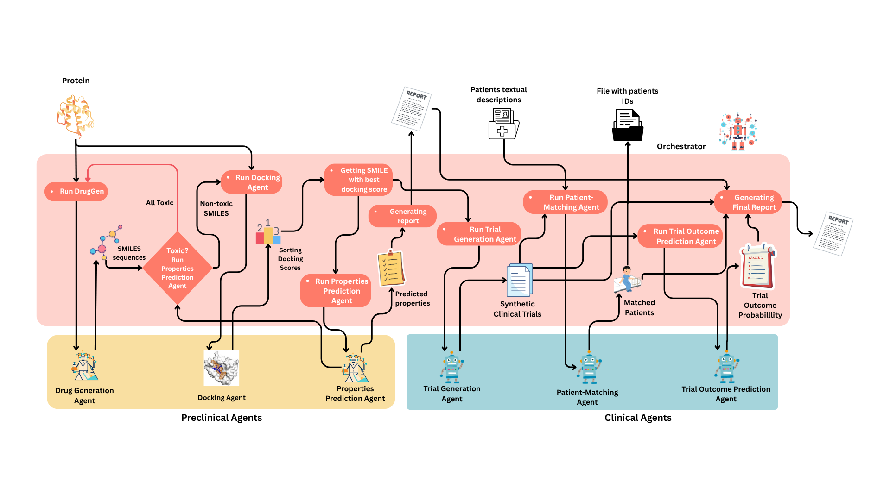

# Prompt-to-Pill: Mapping the Emerging Role of LLMs in End-to-End Drug Discovery

This study presents the Prompt-to-Pill Multi-Agent Pipeline, a comprehensive, modular framework that integrates AI-driven agents across the entire drug development lifecycle—from molecular design to clinical trial simulation. The system is structured into three coordinated phases: Drug Discovery, Preclinical, and Clinical, each governed by a central Orchestrator and a Planning Agent. Within this workflow, specialized agents autonomously handle tasks such as molecular generation, docking, physicochemical and ADMET profiling, lead optimization, trial protocol construction, patient simulation and matching, and outcome prediction. Together, they enable ask-driven simulation of drug development and trial feasibility for a given therapeutic target (see DOI: [https://doi.org/10.1101/2025.08.12.669861]).

---

## 📁 Project Structure

| File                    | Description                                                           |
|-------------------------|-----------------------------------------------------------------------|
| `Prompt-to-pill.py`     | Entry point script to orchestrate the full Prompt-to-Pill multi-agent workflow.                          |
| `druggen_mcp_server.py` | MCP server for the Drug Generator agent.                              |
| `docking_module.py`     | Docking implementation using AutoDock Vina with P2Rank-based pocket detection.                           |
| `docking_mcp_server.py` | MCP server that runs docking as a callable tool.                      |
| `admet_prediction_mcp_server.py`    | MCP server for the ADMET Prediction Agent powered by ChemFM-based models.                                 |
| `chemical_properties_mcp_server.py` | MCP server for the Chemical Properties Agent, computing key RDKit descriptors. |
|`mol_opt_mcp_server.py`| MCP server for the Molecule Optimization Agent, improving lead candidates iteratively.|
|`evaluate_docking.py` | Utility script for analyzing docking results and RMSD benchmarking.|
|`name2smiles_mcp_server.py` | MCP server converting compound names or InChI strings to canonical SMILES.|
|`patient_matching_mcp_server.py` | MCP server for the Patient-Matching Agent using Panacea to align patients with trial criteria.|
|`trialgen_mcp_server.py` | MCP server for the Trial Generation Agent that constructs clinical trial protocols.|
|`trialpred_mcp_server.py` | MCP server for the Trial Prediction Agent predicting trial success with MediTab.|

---

## 🧠 Functionality Overview

### ✅ Workflow Pipeline



This diagram illustrates the Prompt-to-Pill Multi-Agent Architecture, depicting the complete workflow from target input to clinical feasibility report generation. The system is task-dependent—each stage is dynamically configured by the Planning Agent, which selects and executes the appropriate agents and tools based on the specific requirements of the current task.

---

## 🧬 Patient Generation

Synthetic patients were created using Synthea, a realistic health record simulator that exports data in FHIR XML format.

To make this data usable for semantic patient-trial matching, each patient’s clinical narrative was automatically constructed using the script:

patient2trial/patient_topic_expansion.py

From the repository:
 https://github.com/surdatta/patient2trial

These descriptions serve as input to the matching model, which compares patient profiles against generated trial protocols to assess eligibility and similarity.

## 🛠️ Additional Tools
To run this pipeline, the following repositories, models, and tools are required in the workspace:
Repositories
Clone the following repositories into your workspace:

```bash
git clone https://github.com/mahsasheikh/DrugGen.git
git clone https://github.com/RyanWangZf/MediTab.git
```
Panacea-7B-Chat: Download from Hugging Face using the following Python code:

```python
from huggingface_hub import snapshot_download
snapshot_download(
    repo_id="linjc16/Panacea-7B-Chat",
    local_dir="/kaggle/working/",
    token="YOUR_HF_TOKEN",  # Replace with your Hugging Face token
    local_dir_use_symlinks=False
)
```

Install the following tools required for the pipeline with their specific versions:
1. AutoDock Vina: Version 1.1.2
2. MGLTools: Version 1.5.7
3. Open Babel: Version 3.1.1 
4. P2Rank: Version 2.5.1 

## 📋 Requirements

Python 3.11 is needed. Install Python dependencies:
```bash 
pip install -r requirements.txt
pip install -U llama-cpp-python
```

## ▶️ Running the Workflow

Once all MCP servers are launched(for panacea-dependend servers, gpu is required), Patients are in right format, additional tools are installed, run the full pipeline with:
```Bash
python Prompt-to-pill.py
```

