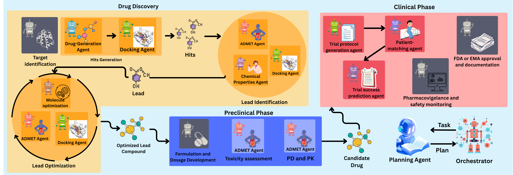

# Prompt-to-Pill: Mapping the Emerging Role of LLMs in End-to-End Drug Discovery

This project implements a modular **multi-agent system** to simulate a full pipeline of drug discovery, from target input to clinical trial feasibility. Agents are orchestrated to perform tasks including molecular generation, docking, toxicity filtering, trial generation, patient simulation, patient-trial matching, and report generation.

---

## 📁 Project Structure

| File                    | Description                                                           |
|-------------------------|-----------------------------------------------------------------------|
| `Orchestrator.py`       | Coordinates communication between all agents and tools in the system. |
| `Prompt-to-pill.py`     | Entry point script to run the full workflow.                          |
| `druggen_mcp_server.py` | MCP server for the Drug Generator agent.                              |
| `docking_module.py`     | Docking implementation using AutoDock Vina. Coordinates must be manually adjusted per target.                           |
| `docking_mcp_server.py` | MCP server that runs docking as a callable tool.                      |
| `http_mcp_server.py`    | MCP server for agents requiring GPU.                                  |

---

## 🧠 Functionality Overview

### ✅ Workflow Pipeline



This diagram illustrates the **end-to-end drug discovery pipeline**, from target protein input to clinical feasibility report generation. Each red bubble represents an agentic function in the orchestrated system.

**Key Stages:**
1. **Input:** A UniProt ID of a protein target is provided.
2. **Drug Generation Agent:** Generates candidate drug-like molecules as SMILES strings using DrugGen.
3. **Docking Agent:** Runs molecular docking (e.g., via AutoDock Vina) to assess binding affinity with the target.
4. **Toxicity Filter / Property Prediction Agent:** Toxic compounds are filtered; properties are predicted for the rest.
5. **Trial Generation Agent:** Constructs a clinical trial protocol using LLMs (language models).
6. **Patient Generation (Synthea):** Synthetic patients are simulated with EHRs and converted to text descriptions.
7. **Patient-Matching Agent:** Matches patients to the generated trial using semantic similarity and classification.
8. **Trial Outcome Prediction Agent:** Estimates success probability of the clinical trial for matched patients.
9. **Final Report:** A summary report integrates molecule properties, trial design, patient matching, and outcome prediction.

---

## 🧬 Patient Generation

Synthetic patients were created using Synthea, a realistic health record simulator that exports data in FHIR XML format.

To make this data usable for semantic patient-trial matching, each patient’s clinical narrative was automatically constructed using the script:

patient2trial/patient_topic_expansion.py

From the repository:
 https://github.com/surdatta/patient2trial

These descriptions serve as input to the matching model, which compares patient profiles against generated trial protocols to assess eligibility and similarity.

## 📦 Required Repositories

To run this pipeline, the following external repositories must be cloned into the same workspace:

```bash
git clone https://github.com/mahsasheikh/DrugGen.git
git clone https://github.com/RyanWangZf/MediTab.git
```

The large language models for molecular property prediction and trial generation (e.g., TxGemma) are loaded directly in: http_mcp_server.py

## 📋 Requirements

Install Python dependencies:
```bash 
pip install -r requirements.txt
```

## ▶️ Running the Workflow

Once all MCP servers are launched, Patients are in right format, docking coordinates are set and models are set up, run the full pipeline with:
```Bash
python Prompt-to-pill.py
```

